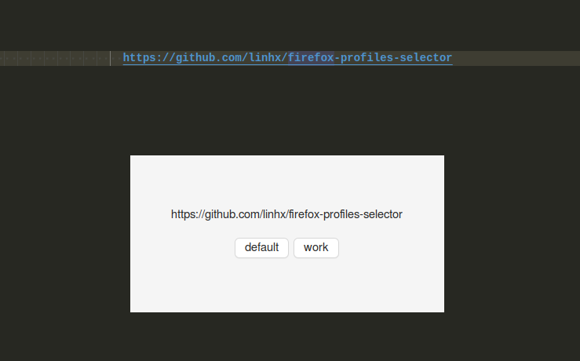

# Firefox profiles selector

Allow to select firefox profile to open an external link

## Motivation

By default, firefox auto open external link in first active profile.
We can show the Profile manager window when open external link by update the command in firefox's desktop file to have `-P` parameter:

```plantext
/yourpath/firefox -P -new-tab %u
```

But opening Profile manager window is slow. So I create this simple app for faster.



## Install

1. Download release file
2. Extract to your apps directory. E.g. `~/apps`
3. Run `cd ~/apps/firefox-profile-selector`. (Replace with your apps directory)
4. Run `./install.sh`
5. Update the `profiles_path` in `config.ini` if needed. If you are not using snap firefox, then it should be `.mozilla/firefox/profiles.ini`

## TODO

- [ ] Keep the app alive if booting app is slow. For now it's just fine.
